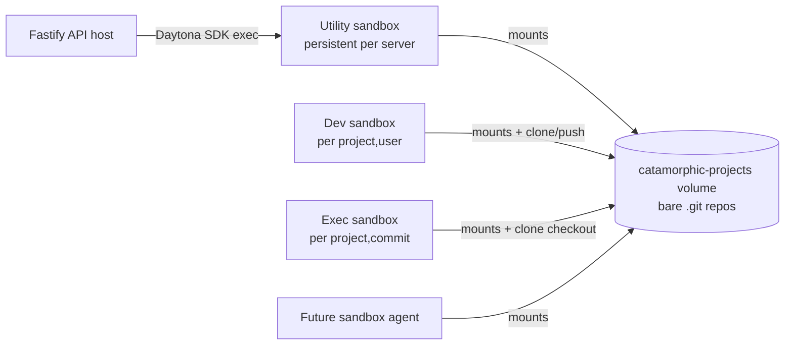

## Current state (what the research found)

- Server always wires `FsBackend` + `FsRemoteBackend` in [`packages/server/src/server.ts`](packages/server/src/server.ts) (lines 21-32). `.env.example` mentions `STORAGE_BACKEND`/`REPO_BASE_PATH` but the server ignores them.
- Host filesystem layout today:
  - Dev working copies: `${PROJECTS_PATH}/<tenantId>/<projectId>/dev/<externalUserId>/` ([`fs-backend.ts`](packages/git/src/fs-backend.ts) lines 16-21).
  - Bare "origins": `${REMOTES_PATH}/<tenantId>/<projectId>.git` ([`fs-remote-backend.ts`](packages/git/src/fs-remote-backend.ts)).
- `DaytonaBackend` + `DaytonaProjectRepo` exist but are **not wired to the server** and use **sandbox-local FS** (no volumes). In-memory sandbox-id map means no persistence across restarts.
- `DaytonaSandboxProvider.createSandbox` never passes `volumes` ([`daytona-provider.ts`](packages/sandbox/src/daytona-provider.ts) lines 40-47). No volume API usage anywhere in the repo.
- Playground today **uploads files per-run** to `/home/daytona/project` ([`playground-executor.ts`](packages/server/src/services/playground-executor.ts) lines 169-212) — it does not clone.
- DB has `projects.storage_type` + `remote_url`, `project_sandboxes.provider_id`, `commit_sha` on runs/messages/sessions. **No volume_id / mount / storage_path columns.**

## Daytona volumes — key facts

From the [volumes docs](https://www.daytona.io/docs/en/volumes) and [TS SDK](https://www.daytona.io/docs/en/typescript-sdk/volume):

- FUSE over S3. Persists beyond sandbox lifecycle. One volume can be mounted to many sandboxes; many volumes per sandbox.
- Mount via `daytona.create({ volumes: [{ volumeId, mountPath, subpath? }] })` — **at sandbox creation**, not after.
- Limits: **100 volumes / org**, no stated per-volume size cap, **no read-only flag yet** ([#3340](https://github.com/daytonaio/daytona/issues/3340)).
- **Slower than local sandbox FS** — unsuitable for hot working trees. No distributed locking.

## Recommended design

### Volume layout — bare repos only, working trees on local sandbox FS

Single org volume (e.g. `catamorphic-projects`, env `CATAMORPHIC_VOLUME_NAME`). Mount at a fixed path inside every sandbox (e.g. `/mnt/catamorphic`).

```
/mnt/catamorphic/
  tenants/
    <tenantId>/
      projects/
        <projectId>.git/            # bare repo — source of truth
  locks/
    <projectId>.lock                # advisory file lock (see concurrency)
```

Rationale:
- FUSE is slow → never run `git status`/checkout against a working tree on the volume. Clone to local sandbox FS (`/home/daytona/project`) at startup, push back on commit.
- Bare repos are write-once-append-mostly; git's push protocol handles concurrency better than shared checked-out trees.
- Keeps the "sandbox agent" future story simple: the agent mounts the same volume, clones the project it cares about into its own working dir.

### Sandbox roles



- **Utility sandbox (new)** — one long-lived sandbox per API process, mounted to the volume, used by the server for ops that need to touch the bare repo without a user dev sandbox (project init, admin merges, deletions, deploy promotions). Replaces today's `FsRemoteBackend` on the host.
- **Dev sandbox** — mounts the volume, clones its bare repo into `/home/daytona/project` on first start, pushes back on every commit. Exists per `(projectId, externalUserId)`.
- **Exec sandbox** — mounts the volume, clones + checks out `commit_sha` into `/home/daytona/project`, runs harness. Ephemeral; keyed by `(projectId, commitSha)`.
- **Future sandbox agent** — same volume mount, same layout.

### Concurrency

- Serialize bare-repo mutations per `projectId` using a **Postgres advisory lock** (`pg_advisory_xact_lock(hashtext(projectId))`) around any server-driven push. Dev sandboxes push through `git` protocol (atomic ref updates) which is safe for the normal case; advisory lock protects admin paths (init, force-reset, delete) from racing a dev push.
- Deletes: drop the directory via the utility sandbox only — never from the API host.

## Code changes

### 1. `packages/git` — new volume-backed backends

- **`DaytonaVolumeBackend`** (`packages/git/src/daytona-volume-backend.ts`) implements `StorageBackend`. `acquireProject` routes to whichever sandbox is the caller (dev or utility). Returns `repoPath` = `/home/daytona/project` (the local clone path), not the volume path.
- **`DaytonaVolumeRemoteBackend`** (`packages/git/src/daytona-volume-remote-backend.ts`) implements `RemoteBackend`. `withOrigin(fn)` runs inside the utility sandbox with the bare repo at `${mountPath}/tenants/<tenantId>/projects/<projectId>.git`.
- Rework `DaytonaProjectRepo` to be parameterized on `(sandboxId, workingDir, originPath)` rather than its current sandbox-local layout.
- Delete/deprecate the unused in-memory-map code in [`daytona-backend.ts`](packages/git/src/daytona-backend.ts).

### 2. `packages/sandbox` — volume mount + utility sandbox

- Extend `SandboxProvider.createSandbox` opts with `volumes?: VolumeMount[]`; wire through `DaytonaSandboxProvider` to `daytona.create({ volumes })`.
- Add `SandboxManagerImpl.ensureUtilitySandbox()` that lazily creates a labeled `purpose=utility` sandbox with the volume mounted at `CATAMORPHIC_VOLUME_MOUNT` (default `/mnt/catamorphic`). Persist its provider id in `project_sandboxes` with a new `sandbox_type='utility'` (project_id nullable for this row or a separate table — see DB section).
- `ensureDevSandbox` / `ensureExecSandbox` now always attach the same volume at the same mount. On first start, run `git clone ${mountPath}/tenants/.../${projectId}.git /home/daytona/project` (plus `git checkout <sha>` for exec).
- On commit in dev sandbox: `git push origin <branch>` — origin URL is `file://${mountPath}/tenants/.../${projectId}.git`.

### 3. `packages/server` — provider selection + wiring

- Replace the hardcoded `FsBackend`/`FsRemoteBackend` in [`server.ts`](packages/server/src/server.ts) with an actual env switch:
  - `STORAGE_BACKEND=fs` (default local dev/tests) → current behavior.
  - `STORAGE_BACKEND=daytona-volume` → `DaytonaVolumeBackend` + `DaytonaVolumeRemoteBackend`, requires `CATAMORPHIC_VOLUME_NAME`, `CATAMORPHIC_VOLUME_MOUNT`, `DAYTONA_API_KEY`.
- On boot: `daytona.volume.get(CATAMORPHIC_VOLUME_NAME, true)` once, cache the `volumeId`.
- Update `PlaygroundExecutor` flow ([`playground-executor.ts`](packages/server/src/services/playground-executor.ts)) and `routes/playground.ts`: stop uploading per-file; instead commit to the dev repo (already happens at lines 54-72 in `routes/playground.ts`) then clone + checkout in the exec sandbox.

### 4. `packages/db` — new migration `008_storage_volume.sql`

- Allow `project_sandboxes.sandbox_type='utility'` with `project_id` nullable **or** add a separate `utility_sandboxes` table keyed by server id (preferred — keeps the FK clean).
- Optional: `projects.storage_backend text` (`fs` | `daytona-volume`) for future mixed-mode tenants; can defer.
- No `volume_id` column needed — it's a singleton tracked in env.

### 5. Migration / rollout

- Phase 1: build `DaytonaVolumeBackend` + plumbing behind `STORAGE_BACKEND=daytona-volume`, keep fs default. Add integration tests (mirrors existing `daytona-backend.integration.test.ts`).
- Phase 2: backfill script (temp `.temp.ts`) that reads every `projects` row, initializes a bare repo on the volume via the utility sandbox, and pushes the current FS tree into it.
- Phase 3: flip env in the hosted deployment.
- Phase 4: (later) switch playground from upload-based to clone-based in exec sandbox.

## Things you may be missing

- **API host never touches the volume directly** — only sandboxes can. Every git op originating in the Fastify process must be proxied through the utility sandbox (extra ~100ms per op). Worth budgeting.
- **Working trees on the volume are a trap** — FUSE perf + no distributed locking. Keep them on local sandbox FS; volume is bare repos only.
- **No RO mounts yet** → any sandbox can corrupt the volume. Treat the mount path as privileged; never expose it to user workflow code (workflows run from `/home/daytona/project`, separate from `/mnt/catamorphic`).
- **Utility sandbox lifecycle** — needs auto-restart if Daytona reaps it (`autoStopInterval` should be `0` / disabled). Track last-known provider_id in DB and re-create on miss.
- **Concurrency** — single writer per project enforced by pg advisory lock on server-driven paths; dev-sandbox pushes rely on git's atomic ref update.
- **Deletes** — when a project is deleted, schedule cleanup of `${mountPath}/tenants/.../${projectId}.git` via the utility sandbox. Today's FS cleanup is synchronous on host.
- **Private `remote_url` support** — if a project has an external `remote_url` (see `projects.storage_type`), the utility sandbox needs git credentials. Use Daytona env vars / `git credential.helper`.
- **Backup** — volumes are S3-backed but that's not a backup. Add a nightly `git bundle` export job (future work).
- **100-volume org cap** — single shared volume is the right call; no per-tenant volumes.
- **Observability** — log every `git clone/push/checkout` with `projectId`, `commitSha`, `sandboxId`. Wire through existing harness reporter pattern.
- **Tests** — existing `fs-backend.test.ts` + `project-repo.test.ts` stay; add a `daytona-volume-backend.integration.test.ts` behind `DAYTONA_API_KEY`.

## Open questions to confirm before coding

1. **Utility sandbox ownership** — one per API instance, or pooled/shared? (I recommend one per instance, reused.)
2. **Playground switch timing** — keep upload-based for now or migrate in the same cut?
3. **Are dev sandboxes per-user-per-project expected to stay alive across sessions**, or should they be ephemeral and clone-on-boot every time? (Affects utility-sandbox load.)