# Catamorphic Batch Workflows

## Agent handoff

This plan belongs entirely to the Catamorphic repository. Implement the generic engine, product surfaces, and a complete reference workflow in the playground. Host-specific business concepts and integrations are out of scope.

Read before implementation:

- [AGENTS.md](AGENTS.md): Catamorphic is an embeddable, code-first framework. Hosts inject identity, Postgres, storage, sandbox providers, plugins, and telemetry.
- [ADR 0001](docs/decisions/0001-code-is-the-source-of-truth.md): workflow logic remains TypeScript, never a JSON/DSL definition.
- [ADR 0002](docs/decisions/0002-embeddable-library-architecture.md): new services must remain host-mountable and tenant-scoped.
- [ADR 0003](docs/decisions/0003-postgres-schema-scoped-storage.md): state lives in the host Postgres under the configurable Catamorphic schema.
- [ADR 0006](docs/decisions/0006-postgres-backed-queue-and-scheduling.md): queueing uses the same Postgres with `FOR UPDATE SKIP LOCKED`; embedding pg-boss is allowed if schema scoping and host injection fit.
- [ADR 0007](docs/decisions/0007-bun-and-unrestricted-workflow-runtime.md): workflows remain unrestricted Bun programs in sandboxes.
- [ADR 0008](docs/decisions/0008-vendor-plugin-packages.md): vendor-specific implementations stay outside vendor-neutral core packages.
- [ADR 0013](docs/decisions/0013-test-and-production-run-modes.md): test and production runs have distinct source, secret, and provenance semantics.
- [plugin contract](packages/plugins/README.md) and [sandbox execution rules](.cursor/rules/sandbox-execution.mdc).

The design below is directionally settled, but its non-trivial decisions must be captured in new ADRs before implementation. In particular, settle the deployment runtime and invocation protocol, reconcile ADR 0013's fresh production sandbox with ADR 0004's per-deployment sandbox, define the code-level batch workflow syntax and replay identity, choose the durable item/run representation, settle per-step batching semantics, and determine whether pg-boss fits Catamorphic’s configurable schema/connection lifecycle. Do not silently contradict an accepted ADR.

## Product model

Catamorphic remains a regular workflow automation engine. **Batch Workflows are an additional first-class workflow type**, not a replacement:

- **Regular workflow:** event/manual/scheduled input starts one workflow run.
- **Batch workflow:** one launch traverses a finite source, gives every source item independent durable state, and optionally collects outputs in a sink.
- Both reuse projects, exported-name identity, immutable deployment artifacts, parser/graph, plugins, secrets, deployment runtimes, ordinary steps, and observability.
- Queueing, replay, cancellation, and step persistence should be shared where semantics match, without changing regular workflow behavior accidentally.
- Host-specific business concepts must not enter Catamorphic core.

There is still no workflow UUID or registry row. A workflow is identified by `(projectId, exportedName)` and an immutable deployment artifact. Batch workflow discovery must remain AST-based from exported TypeScript.

## Research conclusion

Catamorphic already provides the right authoring and embedding foundation, but batch execution needs:

- resumable source initialization and pagination;
- a durable item ledger and bounded fan-out;
- Postgres queueing, worker leases, retries, cancellation, fairness, and backpressure;
- incremental crash-safe step persistence and deterministic replay;
- per-step item or batch execution;
- result retention, idempotent sinks, finalization, and artifact reporting.

Current production runs are synchronous, create a fresh execution sandbox, and persist step reports only when the process exits. `sleep()` is not durable, cancellation is incomplete, and [ADR 0006](docs/decisions/0006-postgres-backed-queue-and-scheduling.md) is not implemented. See [RunsService](packages/core/src/services/runs-service.ts), [runtime harness](packages/runtime/src/harness.ts), and [SandboxManagerImpl](packages/sandbox/src/sandbox-manager.ts).

Batch execution also requires fixing the production hot path before adding batch-specific orchestration:

- production currently clones or uploads the project, transforms source, uploads plugins and the harness, starts `bun run harness.ts`, and destroys the sandbox for every run;
- `SandboxManagerImpl.ensureExecSandbox()` and `project_sandboxes` already model reuse by `(projectId, commitSha)`, but `RunsService` bypasses them;
- project dependencies are not installed in the current run path despite ADR 0007;
- the runtime reporter and cancel routes exist only as incomplete scaffolding;
- Cloudflare provider creation currently ignores labels and auto-stop options, and the bridge is capped at three active container instances by its checked-in configuration.

The reusable execution shape is:

```text
deployment artifact -> warm runtime -> durable invocation -> incremental events
source -> page -> durable item ledger -> step scheduling -> process -> sink/finalize
```

Regular and batch production work must use the same deployment runtime and invocation protocol. Their coordinators and persistence remain different where their semantics differ.

## Deployment runtime

Efficient execution is a prerequisite, not a later optimization. A deployment artifact is the immutable execution unit. Its identity must include:

- project commit SHA;
- resolved plugin package bytes and versions;
- parser/execution-transform version;
- Catamorphic runtime protocol version;
- dependency lockfile and any other inputs that affect executable code.

Secrets are not part of the artifact digest. A production secret rotation creates a new runtime generation or restarts the existing generation so workers receive one consistent environment.

Each deployment artifact has one logical execution environment backed by a sandbox pool. Start with one sandbox replica, but do not encode a permanent one-to-one constraint that prevents later scale-out. Retain old artifact runtimes while pinned work remains, then reclaim them through explicit idle and retention policies.

Materialize each artifact once:

1. Clone or hydrate the pinned project source.
2. Apply the parser execution transform once.
3. Stage the exact resolved plugin artifacts.
4. Run `bun install --frozen-lockfile`.
5. Make deployed code and shared dependencies read-only.
6. Start and health-check the Catamorphic runtime service.

The runtime service is one long-lived Bun HTTP supervisor inside the sandbox. It dispatches invocations to a bounded pool of Bun Worker **threads**, not separate OS processes and not the supervisor's own JavaScript isolate. Each worker handles one invocation at a time, has an isolated module cache and environment copy, and is recycled after failure, timeout, cancellation, or a configurable amount of use. Use child processes only as a provider/runtime fallback if a dependency is incompatible with Bun Workers.

Every invocation gets a writable run-specific directory. User code must not mutate the deployed source tree or another invocation's files. A worker crash or `process.exit()` must not terminate the supervisor or corrupt other logical runs.

Core uses a provider-neutral runtime contract rather than public sandbox URLs:

```typescript
interface DeploymentRuntimeProvider {
  ensureRuntime(args: EnsureDeploymentRuntimeArgs): Promise<DeploymentRuntime>;
  invoke(args: RuntimeInvocation): Promise<RuntimeInvocationReceipt>;
  cancel(args: CancelRuntimeInvocationArgs): Promise<void>;
  getHealth(args: GetRuntimeHealthArgs): Promise<RuntimeHealth>;
}
```

Cloudflare implements this through the Sandbox Bridge and its supported RPC/tunnel primitives; Daytona and custom providers implement the same contract independently. Provider URLs, tunnel tokens, and process IDs remain private to the provider implementation. Every invocation and callback is authenticated, short-lived, tenant-bound, and idempotent.

The invocation protocol is shared by regular workflow runs and batch work. It carries an invocation ID, deployment artifact ID, work kind, target workflow/node, validated payload or references, attempt, deadline, and a signed reporting capability. The runtime reports sequenced start, step, suspension, completion, and failure events back to the host; Postgres remains the durable authority.

Production regular and batch work use this deployment runtime. Test runs retain ADR 0013's mutable per-user dev files, test secrets, null commit SHA, and disposable run directories. They may share the invocation envelope, but never the immutable production artifact or production worker pool.

## Core architecture

```mermaid
flowchart LR
  Definition[Named batch workflow export] --> BatchRun[Batch run pinned to artifact]
  BatchRun --> SourceInit[Initialize source snapshot]
  SourceInit --> PullPage[Pull resumable page]
  PullPage --> ItemLedger[Deduplicate stable item keys]
  ItemLedger --> Queue[Postgres queue]
  Queue --> ItemState[Durable item state]
  ItemState --> StepCoordinator[Per-step coordinator]
  StepCoordinator --> ItemStep[Item step]
  StepCoordinator --> BatchStep[Batch step]
  ItemStep --> Results[Keyed item outcomes]
  BatchStep --> Results
  Results --> Sink[Optional chunked sink]
  Sink --> Finalize[Batch report and artifacts]
  ItemLedger -->|"Below backlog watermark"| PullPage
```



One batch run represents one source traversal. Every item traverses the workflow independently. The source is evaluated once per batch run, not once per workflow step.

## Proposed code-first authoring

The exact syntax needs an ADR and parser spike before parser implementation. Compare a function/directive form aligned with existing `"use workflow"` conventions against a typed helper that the parser can inspect without executing user code. The helper candidate must receive launch input through a callback rather than referring to an undefined module-scope `input`:

```typescript
import { defineBatchWorkflow } from "@catamorphic/workflow";

export const analyzeFeedback = defineBatchWorkflow({
  source: ({ input }) =>
    seededFeedbackSource({
      createdAfter: input.createdAfter,
    }),
  process: async ({ item }) => {
    const normalized = await normalizeFeedback({ feedback: item });
    return classifyFeedback({ feedback: normalized });
  },
  sink: csvSink({
    fileName: "feedback-analysis.csv",
  }),
});
```

Requirements:

- The exported identifier remains the workflow name.
- TypeScript remains the complete source of truth.
- No separate workflow manifest, workflow table, or JSON execution graph.
- The parser can render Source and Sink as first-class graph nodes and validate source/item/result/sink compatibility.
- Existing exported async functions with `"use workflow"` remain regular workflows with unchanged semantics.
- `process` is a complete graphable workflow body with ordinary branches, loops, waits, item steps, and batchable steps—not an opaque callback.
- Batchability extends the existing step model through statically inspectable metadata or a directive; it does not create a runtime-only second step system.

Do not ship parser or public contract changes until the ADR selects one shape. Prefer the simplest TypeScript that is intuitive for humans and agents, type-safe, and straightforward for the AST parser and execution transform.

## Source contract

Sources may be authored inline or imported from attached plugin packages. They use the same runtime-validated contract:

```typescript
type SourceItem<Item> = {
  key: string;
  value: Item;
};

type SourcePage<Item, Cursor extends JsonValue> = {
  items: readonly SourceItem<Item>[];
  nextCursor?: Cursor;
  done: boolean;
};

interface BatchSource<Config, Item, Cursor extends JsonValue, Snapshot extends JsonValue> {
  initialize(args: {
    config: Config;
    context: SourceContext;
  }): Promise<{
    snapshot: Snapshot;
    cursor?: Cursor;
    estimatedCount?: number;
  }>;

  readPage(args: {
    config: Config;
    snapshot: Snapshot;
    cursor?: Cursor;
    limit: number;
    context: SourceContext;
  }): Promise<SourcePage<Item, Cursor>>;
}
```

Contract invariants:

- `key` is stable and unique within the logical source. Enforce `UNIQUE (batch_run_id, item_key)`.
- `cursor` and `snapshot` are opaque JSON, validated and persisted after each accepted page.
- Re-reading the same cursor may repeat items but must not lose items.
- Every source declares `snapshot`, `bounded`, or `best_effort` consistency.
- Database sources use a high-water mark and keyset pagination, not mutable offset pagination.
- Reads are side-effect-free, abortable, retry-classified, and payload-size bounded.
- Large values use stable references rather than oversized queue payloads.
- `done` eventually becomes true. Infinite/event streams are not batch sources.
- Sources never enqueue jobs. The engine owns dedupe, backpressure, pause, cancel, fairness, and retries.

Plugin manifests need versioned source capability metadata: source ID, config/item/cursor/snapshot schemas, consistency support, execution location (`host` or `sandbox`), and docs/types for the coding agent. Reuse and extend the existing plugin package flow; do not create a second plugin system.

Inline and sandbox plugin sources run through the pinned deployment runtime. Trusted hosts may inject server-side adapters for efficient local database or API access, but adapters use the same contract and receive tenant identity from the scoped Catamorphic context. Catamorphic never queries host tables directly, never sends host database credentials into arbitrary workflow code, and never trusts a workflow-supplied tenant ID.

## Durable materialization

Persist separate generic records for:

- batch run and immutable definition/version references;
- source snapshot, cursor, consistency mode, and progress;
- logical items and their current/terminal status;
- physical step invocations and immutable invocation membership;
- keyed step outcomes and retry state;
- sink state, chunk claims, acknowledgements, and artifacts.

Recommended behavior:

- Initialize the source, pull one page, then transactionally insert deduplicated item rows, create ready work, enqueue IDs, and advance the accepted cursor.
- Pull another page only while queued/in-flight items remain below a configurable high-water mark.
- Keep queue payloads compact; store IDs/references rather than full large inputs.
- Item states include `pending`, `running`, `waiting`, `succeeded`, `failed`, `skipped`, and `canceled`.
- Batch states include `sourcing`, `running`, `sinking`, `completed`, `completed_with_errors`, `failed`, and `canceled`.
- Default failure policy is continue-and-report with bounded retries. Also support explicit fail-fast and maximum-error thresholds.

Use separate `batch_runs`, lightweight `batch_items`, item step outcomes, and physical invocation records by default. Do not create a child `workflow_runs` row per item unless a one-million-item schema and retention benchmark demonstrates that it is operationally acceptable. The lighter model must still preserve graph-linked step history and replay semantics.

## Per-step item and batch execution

Batching is a **per-step property**:

- **Item step:** receives one item. Use for per-item branching, waits/signals, compliance checks, and non-batchable side effects.
- **Batch step:** receives compatible items parked at the same node. Use for LLM bulk inference, embeddings, database bulk writes, and provider batch APIs.
- The workflow call remains item-shaped. Only the batch step implementation receives `items`; keyed outcomes resume each item independently.

Proposed shape:

```typescript
const classifyFeedback = defineBatchStep({
  batch: {
    maxItems: 100,
    maxWait: "2 seconds",
    maxBytes: 1_000_000,
  },
  run: async ({ items }) =>
    items.map(({ key, value }) => ({
      key,
      result: classifyFeedbackItem({ feedback: value }),
    })),
});
```

Coordinator rules:

- Compatibility requires the same tenant/security boundary, deployment artifact, workflow/node, step version, serialized non-item arguments, and plugin partition key.
- Close a physical batch at `maxItems`, `maxBytes`, or `maxWait`. A partial batch must eventually run.
- Record immutable membership before invocation.
- Every input has a stable key. Require exactly one keyed success or classified error per input.
- Reject missing, duplicate, or unknown outcome keys.
- Persist successes independently and retry only unresolved items.
- Retried items may form a differently composed batch.
- Batch membership is nondeterministic, so a step cannot depend on which unrelated items happen to be co-batched.
- Stable cohort/window calculations need an explicit grouping/reducer primitive or sink/finalizer.
- A batch step cannot sleep one member internally; return its outcome, then let that item enter an ordinary wait step.

Keep these controls separate:

- source page size;
- queue claim size;
- step `maxItems`/`maxBytes`/`maxWait`;
- warm-sandbox execution concurrency;
- sink chunk size.

## Queue and rate limiting

Use Postgres in the host-provided Catamorphic schema. Keep `LISTEN/NOTIFY` as a wake-up hint with polling fallback. Never hold a claim transaction while executing sandbox or external I/O.

Run a focused pg-boss compatibility spike before committing:

- configurable schema;
- host-provided `pg.Pool`/transaction lifecycle;
- migration ownership;
- worker start/stop under `createCatamorphic`;
- transactional enqueue with Catamorphic writes;
- tenant fairness and observability hooks;
- no assumptions about a standalone server.

If pg-boss fits, keep it behind an internal queue adapter. If it does not, implement the minimal ADR-0006 `SKIP LOCKED` queue with explicit leases, heartbeats, retries/backoff, scheduling, DLQ/redrive, priority, and maintenance. Do not expose queue-library APIs to workflow authors.

Rate limits are separate from queue concurrency. Add Postgres rate reservations with global and partition keys. Atomically reserve deterministic bucket rows using database time; on capacity miss, reschedule without consuming an execution retry. Support source API, tenant, model/provider, action, and host-supplied keys. Honor `Retry-After` through `blocked_until`.

## Durable workflow execution

Use deterministic replay rather than serializing arbitrary JavaScript locals:

- Persist step completion incrementally under stable run/node/occurrence identity.
- On resume, rerun from the workflow start and return persisted outputs for completed calls.
- Implement the runtime reporter so start/completion/suspension reaches Postgres before process exit.
- Add durable `sleepUntil()` and `waitForSignal()` with scheduled resume.
- Keep side effects and nondeterminism inside instrumented steps; provide durable time/UUID/random primitives where needed.
- External effects remain at-least-once. Use stable effect IDs, provider idempotency keys where available, and reconciliation.
- Reuse provider-neutral sandbox contracts. Do not call Cloudflare or Daytona SDKs from core.
- The shared deployment runtime amortizes sandbox, dependency, transform, plugin, and Bun startup costs while logical state and failure remain invocation- and item-scoped.

## Result and sink contract

`process` returns a runtime-validated result per item. An optional sink consumes terminal records in bounded chunks.

- Every sink record carries item key, success/error state, output/reference, attempt metadata, and stable ordering metadata.
- The engine assigns a deterministic chunk key and persists sink checkpoints.
- `writeBatch` is idempotent by chunk key; retry only unacknowledged chunks.
- `finalize` receives aggregate counts and sink state and returns artifact references/metadata without loading all results in memory.
- Retention may keep inline JSON, object references, or delete item output after durable sink acknowledgement.
- XLSX export should first write restartable row chunks, then assemble during finalization. Split at Excel’s 1,048,576-row limit; offer CSV/Parquet for larger output.
- Without a sink, item results remain queryable and failed subsets remain retryable.

## Playground reference example

The reference host must ship a complete, credential-free batch workflow in its seed data. Use a **Customer Feedback Analysis** example that exercises the generic engine rather than a host-specific integration:

1. Seed enough feedback records to require multiple source pages, with stable record keys and deterministic ordering.
2. Read them through a playground-owned `seededFeedbackSource` host adapter using a high-water mark and keyset pagination.
3. Normalize and validate each item through ordinary item steps.
4. Branch invalid records into a visible skipped or failed outcome.
5. Coalesce valid records at a batchable classification step with item, byte, and time limits.
6. Include a deterministic fail-once case so retry and partial physical-batch recovery are observable without making the final demo flaky.
7. Write terminal outcomes through an idempotent chunked CSV sink.
8. Finalize one downloadable artifact and display aggregate counts, throughput, failures, retry attempts, item history, and sink progress in the Batch Runs UI.

The example must run locally without third-party credentials or network access. The playground owns its seed records and trusted source/sink adapters; reusable contracts and orchestration remain in Catamorphic packages.

## Implementation phases

### 0. Decisions and focused spikes

- Reconcile the per-run production sandbox statement in ADR 0013 with the per-deployment execution model in ADR 0004 and record the deployment runtime decision.
- Specify deployment artifact identity, runtime generations, lifecycle, cleanup, provider-private ingress, invocation authentication, and the supervisor/Bun Worker isolation model.
- Spike the long-lived runtime on Cloudflare and Daytona, including process health, sandbox sleep/wake, request routing, cancellation, and worker replacement.
- Spike pg-boss compatibility before selecting the internal queue implementation.
- Prototype the competing batch authoring forms without shipping parser changes.
- Run a one-million-item schema/index/retention benchmark and select the lightweight item record model.
- Record the settled batch workflow, source/sink trust boundary, per-step batching, replay occurrence identity, test/production behavior, durability, and sink decisions in ADRs and index them.

### 1. Deployment runtime and regular production execution

- Add deployment artifact and runtime-generation persistence without introducing workflow registry rows.
- Materialize transformed source, pinned plugins, and frozen dependencies once per artifact.
- Extend provider-neutral sandbox contracts for runtime lifecycle, health, invocation, and cancellation.
- Implement the long-lived Bun supervisor with bounded Bun Worker threads and run-specific writable directories.
- Route regular production workflows through the shared invocation protocol and reusable execution sandbox.
- Keep test runs on per-user dev files and test secrets with disposable directories.
- Add lifecycle reconciliation, idle cleanup, old-artifact retention, and provider capacity telemetry.

### 2. Async durable execution substrate

- Implement ADR 0006's internal queue adapter and host-controlled `startWorker()`/`stopWorker()`.
- Make regular production triggering enqueue a pending run instead of blocking the request through completion.
- Implement authenticated, sequenced runtime reporting with incremental step persistence.
- Implement cancellation, leases, heartbeats, retries/backoff, deadlines, DLQ/redrive, priority, and tenant fairness.
- Add stable node/occurrence replay identity, idempotent resume, durable `sleepUntil()`, and `waitForSignal()`.
- Prove crash recovery and external-effect idempotency with regular workflows before adding batch fan-out.

### 3. Batch contracts, parser, and persistence

- Add Zod-backed public/runtime types for batch definitions, sources, keyed outcomes, batch-step policy, sinks, consistency, and failure policy.
- Extend parser/graph discovery for named batch workflow exports and Source/Sink nodes without affecting regular workflows.
- Add exhaustive parser, execution-transform, and type-contract tests.
- Add forward-only schema-scoped migrations and regenerate DB types.
- Add async batch triggering, source initialization/paging, item-key dedupe, bounded fan-out, pause/cancel, progress aggregation, retention, and metrics.
- Expose tenant-scoped server-sdk and Fastify APIs; regenerate OpenAPI and API client types.

### 4. Item and batch-step execution

- Add the step coordinator using short `SKIP LOCKED` claims and immutable invocation membership.
- Execute item steps through the shared deployment runtime and batch steps once per recorded cohort.
- Validate and persist keyed member outcomes independently.
- Add rate reservations, compatibility partitions, poison-item handling, and subset retry.
- Verify that regular work cannot be starved by batch fan-out.

### 5. Sinks, product surfaces, and playground example

- Implement result chunk claims, sink checkpoints, finalization, artifact references, partial-failure reports, and subset retry.
- Add React hooks and generic Batch Runs UI for source progress, item states, throughput/ETA, artifacts, pause/cancel, inspection, and retry.
- Extend plugin documentation/context injection for source and sink capabilities.
- Add the complete Customer Feedback Analysis seed source, workflow, sink, data, and UI walkthrough to the playground.

## Mandatory acceptance tests

- Regular workflow parsing and test-run semantics remain unchanged.
- Regular and batch production work use the same provider-neutral invocation protocol without launching a new Bun CLI process per invocation.
- Deployment artifacts change when executable source, resolved plugins, dependencies, transform version, or runtime protocol changes.
- Concurrent invocations have isolated module caches, environments, and writable directories.
- A worker timeout, crash, `process.exit()`, or cancellation does not terminate the supervisor or corrupt another invocation.
- A sleeping or replaced sandbox restores the correct artifact and runtime generation before accepting work.
- Provider URLs, tunnel credentials, and runtime authentication material never enter public core DTOs or logs.
- Production batch runs freeze their deployment artifact and use production secrets; test batch runs, if exposed, retain null-SHA and test-secret semantics.
- Source replay before/after cursor persistence never loses or duplicates logical items.
- Mutable DB data obeys declared snapshot/high-water-mark behavior.
- Expired API cursors retry or fail explicitly without advancing state.
- Invalid plugin config, cursor, item, outcome, or sink acknowledgement fails runtime validation.
- One million sourced items remain within configured DB, queue, and memory watermarks.
- One tenant’s backlog cannot starve another tenant or ordinary workflow traffic.
- Worker death during source pull, item execution, outcome persistence, sink write, or finalization resumes idempotently.
- Batch steps flush at item/byte/time limits and never cross compatibility boundaries.
- Missing, duplicate, and unknown outcome keys are rejected.
- Partial success resumes successes and retries only unresolved items, even with different retry batch composition.
- Item steps branch/sleep independently before and after batch steps.
- Sink partial failure retries only unacknowledged chunks.
- Pause/cancel at high cardinality prevents future effects without synchronous per-item signaling.
- Queue bloat, indexes, WAL, autovacuum, retry storms, and retention remain inside defined SLOs.
- OpenTelemetry spans include tenant, project, batch run, item, workflow, step, queue wait, source page, and sink chunk identities without leaking payloads/secrets.
- The seeded Customer Feedback Analysis workflow runs without external credentials and demonstrates paging, item steps, batch coalescing, retry, partial outcomes, CSV finalization, and UI inspection.

## Guardrails

- No giant batch-wide workflow run or unbounded item array.
- No raw `AsyncIterable` as the durable source abstraction.
- No infinite source in batch mode.
- No source-controlled enqueueing or sink-controlled completion.
- No assumption of exactly-once external I/O.
- No direct host database credentials in arbitrary sandbox code.
- No provider pacing based only on worker concurrency.
- No unbounded execution in the supervisor's JavaScript isolate.
- No public sandbox or tunnel URL as part of the core execution contract.
- No vendor SDK dependency in vendor-neutral core packages.
- No hard-coded schema, database connection, tenant, filesystem path, or standalone boot.
- No host-specific business concepts in Catamorphic core.

## Completion checks

Follow [AGENTS.md](AGENTS.md): migration/codegen sync, generated API sync, lint, typecheck, build, full tests, and browser verification for product surfaces. Do not commit or push unless explicitly requested.
