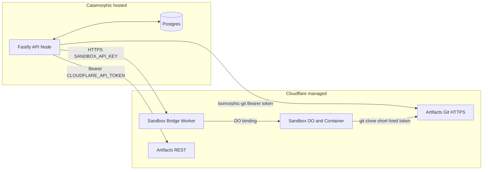

# Cloudflare integration

How Catamorphic uses Cloudflare for workflow sandboxing and (soon) Git storage, and how to provision both for development and production.

Related: [`AGENTS.md`](./AGENTS.md).

---

> **Default provider: Daytona.** Until further notice, the host's boot code (see OpenCX's `backend/src/catamorphic/boot.ts`) always wires Daytona when `DAYTONA_API_KEY` is set, even if the Cloudflare env vars are also populated. The Cloudflare Bridge path stays wired up and maintained, but the host selection logic prefers Daytona and only falls through to Cloudflare when `DAYTONA_API_KEY` is unset. Treat everything below as reference for the Cloudflare path — not as the active production choice.

---

## TL;DR

- **Sandbox provider (active default)**: Daytona. Enabled via `DAYTONA_API_KEY`. Preferred over Cloudflare whenever set.
- **Sandbox provider (alternate)**: [Cloudflare Sandbox](https://developers.cloudflare.com/sandbox/) — isolated VM per deployment — accessed through a thin Worker we deploy called the **Sandbox Bridge**. Only selected when `DAYTONA_API_KEY` is unset.
- **Git storage (in progress)**: [Cloudflare Artifacts](https://developers.cloudflare.com/artifacts/) — versioned repos with a Git-compatible HTTPS remote — accessed directly from the Fastify server via REST + [`isomorphic-git`](https://isomorphic-git.org/).
- **Worker deploy**: `wrangler deploy` to Cloudflare's edge — nothing to self-host.
- **Fastify host**: unchanged — runs on our existing container platform and calls the Bridge Worker over HTTPS when the Cloudflare path is selected.

---

## Why these decisions

### Why Cloudflare Sandbox

- True VM-level isolation per sandbox (CPU, memory, disk), not shell-level.
- Built-in lazy start, idle shutdown, and Active-CPU billing fits workflow-run workloads (bursty, mostly idle).
- Same auth surface as Artifacts, Workers, Durable Objects — one vendor for execution + storage.

### Why a Worker is required (no direct Node integration)

Cloudflare is explicit ([Sandbox bridge docs](https://developers.cloudflare.com/sandbox/bridge/)):

> "The Sandbox SDK is designed for use within Cloudflare Workers. If your application runs outside of the Workers ecosystem, it cannot interact with sandboxes directly."

Concrete reasons it cannot live inside the Fastify process:

- `getSandbox(env.Sandbox, id)` requires a **Durable Object binding**, a Workers-runtime construct with no Node polyfill.
- `workerd` (Cloudflare's open-source Workers runtime) can run DOs locally but **does not include Containers**. Self-host runtimes omit them too.
- Containers are a proprietary service — they only run on Cloudflare's edge.

So we accept one Worker and keep it tiny: the Bridge exists only to translate HTTP calls into Sandbox SDK operations.

### Why one shared Worker, not a sidecar per Fastify replica

- Workers run on Cloudflare's edge, so a "local sidecar" isn't possible.
- Sandboxes are keyed by id **across the whole account**. Two sidecars calling `getSandbox(env, "deploy-abc")` resolve to the same underlying VM anyway.
- One Worker per environment (`dev`, `prod`) is the right granularity. All Fastify replicas talk to the same Worker URL.

### Why `isomorphic-git` (not native `git` CLI) for Artifacts

- Pure JS — no `git` binary dependency in the server image or CI runners.
- Same library Cloudflare recommends inside Workers, so logic is portable if we ever move it behind the Bridge.
- Node gives us a real filesystem, so we use `isomorphic-git/http/node` against a local working directory (no MemoryFS needed).

### Why `instance_type` is not configurable per project

Workflows in the same deployment share the same code and trust boundary, so per-deployment sizing is enough — a fixed instance type, set once in the Bridge Worker's `wrangler.jsonc`, covers every workflow inside that deployment.

Making it configurable means a new column on `projects`, propagation through the API → Fastify → Bridge, and UX to set it. The rest of the product doesn't yet surface "how big should this be" anywhere; adding that knob before we have a workload that outgrows `lite` creates a speculative dimension in the schema.

When we see real workflows that hit memory/CPU caps on `lite`, the cheapest fix is to raise the global default. Per-project defaults + a per-deployment override are the next step after that if sizing turns out to be workload-specific.

### Why one sandbox per deployment (no multi-VM fan-out)

Cloudflare Sandboxes don't have built-in load-based autoscaling. Distributing runs across more than one VM means the **application** picks distinct `getSandbox` ids (per-run id, shard pool, etc.) and operates a dispatcher. Cloudflare's [Scaling and Routing](https://developers.cloudflare.com/containers/platform-details/scaling-and-routing/) docs describe only fixed-N `getRandom` today and call built-in autoscaling a roadmap item.

One sandbox per `(projectId, commitSha)` matches how we already reason about immutable deployments (`SandboxManagerImpl.ensureExecSandbox`): a deployment is the artifact, and the sandbox is its execution environment. With Active-CPU billing, an idle-but-present sandbox is cheap, so "always-on per deployment" isn't a cost problem either.

What this gives up is **parallelism per deployment**: concurrent runs of the same deployment share CPU/RAM and filesystem side effects inside one VM. That stays acceptable until we need either (a) hard blast-radius isolation between runs of the same deployment or (b) throughput that exceeds one VM's caps. The answer at that point is **many VMs per deployment** (shard pool or per-run sandboxes with a queue/dispatcher) — never more sessions inside one VM, which don't partition CPU/RAM at all ([Sandbox sessions](https://developers.cloudflare.com/sandbox/concepts/sessions/)).

---

## Architecture



### How a run executes today

1. Fastify resolves the project → uses `FsBackend` to get a local working directory at `commitSha`.
2. `CloudflareSandboxProvider.createSandbox` via the Bridge Worker with `sandboxId = deploy-{projectId}-{commitSha}`.
3. Upload the working tree + a generated `harness.ts` into the sandbox at `/workspace/project` through the Bridge's file-upload API.
4. Exec inside the sandbox: `cd /workspace/project && bun run harness.ts`.
5. Collect output, update `workflow_runs`, destroy the sandbox (or let it sleep).

### How a run will execute once Artifacts is wired up

1. Fastify resolves the project → ensures an Artifacts repo + local working dir via `ArtifactsBackend`.
2. Writes workflow files into the working dir, commits, pushes to the Artifacts remote via `isomorphic-git`.
3. Mints a short-lived write token for the repo via Artifacts REST.
4. `CloudflareSandboxProvider.createSandbox` with `sandboxId = deploy-{projectId}-{commitSha}`.
5. Passes `ARTIFACTS_GIT_REMOTE` (authenticated HTTPS remote) + the generated `harness.ts` to the sandbox.
6. Exec: `git clone $ARTIFACTS_GIT_REMOTE project && cd project && git checkout $COMMIT_SHA && bun run harness.ts`.
7. Collect output, update `workflow_runs`, destroy the sandbox (or let it sleep).

The `StorageBackend` interface isolates the two paths — swapping `FsBackend` for `ArtifactsBackend` does not change the provider/executor contract.

---

## Monorepo layout

- `packages/cloudflare-sandbox-bridge/` — the Bridge Worker (deployed to Cloudflare). Contains `wrangler.jsonc`, `Dockerfile` (extends `cloudflare/sandbox` base), and a thin Worker entry that re-exports the `Sandbox` + `WarmPool` Durable Objects and delegates all routing to `@cloudflare/sandbox/bridge`.
- `packages/sandbox/src/cloudflare-provider.ts` — `CloudflareSandboxProvider` implementing `SandboxProvider` as an HTTP client against the Bridge Worker.
- `packages/git/src/artifacts-backend.ts` — `ArtifactsBackend` implementing `StorageBackend` via Artifacts REST + `isomorphic-git` (not yet implemented; see [TODO](#todo)).
- Host boot code (e.g. OpenCX's `backend/src/catamorphic/boot.ts`) — selects Cloudflare providers when CF env vars are present; falls back to Daytona/`FsBackend` otherwise.

---

## Environment variables

### Where to put `.env` values in this repo

We use `.env` files (not `.env.local`) in this setup:

| File | Purpose | Required keys |
| --- | --- | --- |
| Host app `.env` | Primary env source — catamorphic is embed-only, so the host process owns these | `CLOUDFLARE_SANDBOX_API_URL`, `CLOUDFLARE_SANDBOX_API_KEY` |

> For workflow execution, the Cloudflare sandbox vars must be present in the **host process environment** (catamorphic runs in-process inside the host).

### Runtime (Fastify server + playground)

| Variable | Purpose | Scope |
| --- | --- | --- |
| `CLOUDFLARE_ACCOUNT_ID` | Identifies the CF account for REST + Git URLs | Both |
| `CLOUDFLARE_API_TOKEN` | Auth for Artifacts REST (create repo + mint tokens) | Both |
| `CLOUDFLARE_ARTIFACTS_NAMESPACE` | Namespace grouping repos (e.g. `catamorphic-dev`, `catamorphic-prod`) | Both |
| `CLOUDFLARE_SANDBOX_API_URL` | URL of the deployed Bridge Worker (`http://localhost:8787` in dev) | Both |
| `CLOUDFLARE_SANDBOX_API_KEY` | Shared bearer key between server and Bridge Worker | Both |
| `DAYTONA_API_KEY` | Optional — fallback provider when CF vars unset | Optional |

### Bridge Worker (deploy-time, not Fastify's runtime env)

| Variable | Purpose | Where |
| --- | --- | --- |
| `CLOUDFLARE_API_TOKEN` | Used by `wrangler deploy` to publish the Worker + container image | CI / dev machine |
| `SANDBOX_API_KEY` (Worker secret) | Bridge's secret for authenticating inbound HTTPS from Fastify | `wrangler secret put` |

> The Bridge's `SANDBOX_API_KEY` must equal Fastify's `CLOUDFLARE_SANDBOX_API_KEY`.

---

## Provisioning Cloudflare

### Prerequisites

- A Cloudflare account on the **Workers Paid** plan (required for Containers — [pricing](https://workers.cloudflare.com/product/containers)).
- The **Containers / Sandbox beta** enabled on the account (request via the Cloudflare dashboard if not visible).
- Docker Desktop installed locally (required for `wrangler dev` and for building the container image).
- `bun` + `wrangler` installed (`bun add -g wrangler` or use the pinned version in the monorepo).

### Find your account ID

Two ways:

- **CLI**: after `wrangler login` or with `CLOUDFLARE_API_TOKEN` exported, run `bunx wrangler whoami` — it prints the account ID alongside your email.
- **Dashboard**: any Workers / Pages page → right sidebar → **Account ID** (has a copy button).

Export it:

```bash
export CLOUDFLARE_ACCOUNT_ID="<your-account-id>"
```

### Option A: `wrangler login` (easiest for dev)

```bash
bunx wrangler login
```

Opens a browser, completes OAuth, stores credentials in `~/.wrangler/`. After this, `wrangler deploy`, `wrangler dev`, `wrangler secret put`, and `wrangler artifacts` commands all work without explicit tokens.

For Fastify runtime (Artifacts REST calls), you still need an API token — see Option B.

### Option B: API token (required for CI; optional for local)

Dashboard → **My Profile** → **API Tokens** → **Create Token** → **Create Custom Token**.

Token scopes for a single "catamorphic server" token:

- Account → **Workers Scripts: Edit** — covers the Worker deploy, its **Durable Object** classes + migrations, and attached **Containers**. There is no separate "Durable Objects" or "Containers" permission in the token UI — they're all rolled under Workers Scripts ([permissions reference](https://developers.cloudflare.com/fundamentals/api/reference/permissions)).
- Account → **Artifacts: Edit** — create repos + mint scoped repo tokens.
- (Optional) Account → **Workers Tail: Read** — needed only if you want `wrangler tail` for remote logs.
- Account resources → include your account.
- TTL → your call; `1 year` is a common choice for non-prod.

For deploying the Bridge Worker to Cloudflare (`wrangler deploy --env dev` / `--env production`), ensure the token has at least:

- Account → **Workers Scripts: Edit** (required, includes DO + Containers deployment path)
- (Optional) Account → **Workers Tail: Read** (for `wrangler tail`)
- Account resources scoped to the target account

Save the token **immediately** — Cloudflare shows it once. Export it:

```bash
export CLOUDFLARE_API_TOKEN="<your-token>"
```

For **prod**, create a separate, narrower runtime-only token that the Fastify server carries:

- Account → **Artifacts: Edit** (only).
- A separate deploy token for CI holds the Workers / Containers / DO scopes and stays out of the Fastify runtime.

### Enable Artifacts

Artifacts is in private beta at the time of writing. API calls return `HTTP 403` with code `10004` ("Access denied by feature gate") until the account is approved.

1. Dashboard → **Build** → **Storage & Databases** → **Artifacts** → register for the beta.
2. Wait for approval (often near-instant for Workers Paid accounts; sometimes queued).
3. Verify with:
   ```bash
   curl -sS -H "Authorization: Bearer $CLOUDFLARE_API_TOKEN" \
     "https://api.cloudflare.com/client/v4/accounts/$CLOUDFLARE_ACCOUNT_ID/artifacts/namespaces/default/repos"
   ```
   Expect `HTTP 200` (possibly with an empty repo list). If still `403`, the beta hasn't been granted yet.

Once public beta lands, no explicit registration is needed.

### Create an Artifacts namespace (after beta approval)

```bash
bunx wrangler artifacts namespace create catamorphic-dev
bunx wrangler artifacts namespace create catamorphic-prod
```

Export the chosen name into your shell:

```bash
export CLOUDFLARE_ARTIFACTS_NAMESPACE="catamorphic-dev"
```

### Choose a shared Bridge API key

Pick any random string (e.g. `openssl rand -hex 32`). It becomes:

- `CLOUDFLARE_SANDBOX_API_KEY` in the Fastify env.
- `SANDBOX_API_KEY` as a Worker secret (see deploy below).

Use a different value per environment.

---

## Local development

Goal: everything runs on your laptop. The sandbox path hits a local Worker via `workerd` + Docker and does **not** call Cloudflare's edge. Artifacts is not wired up yet (see [TODO](#todo)) so nothing in the current server code reaches out to the Cloudflare API.

### 1. Install prerequisites

- Docker Desktop running (Wrangler starts the sandbox container via Docker).
- `bun install` at the repo root.
- Postgres reachable at `DATABASE_URL` (the repo's Docker Compose brings one up).

### 2. Set the shared bearer for the Bridge

Copy the example and leave the default key in place for dev:

```bash
cp packages/cloudflare-sandbox-bridge/.dev.vars.example packages/cloudflare-sandbox-bridge/.dev.vars
# SANDBOX_API_KEY=local-dev
```

### 3. Configure server + playground env vars

Root `.env` (used by the Fastify server):

```env
CLOUDFLARE_SANDBOX_API_URL=http://localhost:8787
CLOUDFLARE_SANDBOX_API_KEY=local-dev
```

`CLOUDFLARE_ACCOUNT_ID` / `CLOUDFLARE_API_TOKEN` / `CLOUDFLARE_ARTIFACTS_NAMESPACE` are unused by the server runtime today — leave them commented in the host's env file until `ArtifactsBackend` lands.

### 4. Run everything together

```bash
bun run dev   # repo root — turbo brings up server + playground + bridge
```

This runs `wrangler dev` inside `packages/cloudflare-sandbox-bridge` as one of the turbo processes, which in turn builds and starts the sandbox container image via Docker on `http://localhost:8787`. First boot takes a minute or two (image build); subsequent boots are fast.

Smoke-test the bridge without leaving the shell:

```bash
curl http://localhost:8787/health
# => {"ok":true}
```

### 5. Default path uses Daytona

Daytona is the default sandbox provider until further notice. If `DAYTONA_API_KEY` is set, the server uses Daytona even when the Cloudflare env vars are also populated. To exercise the Cloudflare path locally, unset `DAYTONA_API_KEY` (in addition to having `CLOUDFLARE_SANDBOX_API_URL` + `CLOUDFLARE_SANDBOX_API_KEY` set). Storage always uses the local `FsBackend` today regardless of which sandbox provider is active.

---

## Cloudflare dev deploy (real edge worker)

Use this when you want the bridge on Cloudflare edge (not `wrangler dev`):

```bash
cd packages/cloudflare-sandbox-bridge
bunx wrangler secret put SANDBOX_API_KEY --env dev
bunx wrangler deploy --env dev
```

Then set the server/runtime env values in your `.env` files:

```env
CLOUDFLARE_SANDBOX_API_URL=https://catamorphic-sandbox-bridge-dev.<subdomain>.workers.dev
CLOUDFLARE_SANDBOX_API_KEY=<same-value-used-in-wrangler-secret-put>
NEXT_PUBLIC_API_URL=http://localhost:8500
```

If deploy fails with `Forbidden` / authentication errors, re-check that your token has **Workers Scripts: Edit** and is scoped to the correct account.

## Production setup

### 1. Build + deploy the Bridge Worker

```bash
cd packages/cloudflare-sandbox-bridge
bunx wrangler secret put SANDBOX_API_KEY --env production
# paste the prod shared key when prompted
bunx wrangler deploy --env production
```

This builds the container image, pushes it to Cloudflare's registry, and deploys the Worker. Note the deployed URL (e.g. `https://catamorphic-sandbox-bridge.<subdomain>.workers.dev`).

### 2. Set Fastify prod env vars

Configure these on the CaaS running Fastify:

```env
CLOUDFLARE_ACCOUNT_ID=<prod-account-id>
CLOUDFLARE_API_TOKEN=<prod-runtime-only-token>   # Artifacts: Edit only
CLOUDFLARE_ARTIFACTS_NAMESPACE=catamorphic-prod
CLOUDFLARE_SANDBOX_API_URL=https://catamorphic-sandbox-bridge.<subdomain>.workers.dev
CLOUDFLARE_SANDBOX_API_KEY=<same-value-as-worker-secret>
```

### 3. CI

- Secrets: `CLOUDFLARE_API_TOKEN` (deploy-capable), `CLOUDFLARE_ACCOUNT_ID`.
- Deploy step: `bunx wrangler deploy --env production` from `packages/cloudflare-sandbox-bridge`.
- E2E secrets: same `CLOUDFLARE_*` runtime vars as Fastify, pointed at a dev or staging Bridge URL.

### 4. Rotate

- Rotate `SANDBOX_API_KEY`: `wrangler secret put SANDBOX_API_KEY --env production` → update `CLOUDFLARE_SANDBOX_API_KEY` on Fastify → rolling restart.
- Rotate `CLOUDFLARE_API_TOKEN`: regenerate in dashboard → update Fastify env → rolling restart. Artifacts tokens we mint per-operation have short TTLs and don't need rotation.

---

## Troubleshooting

- **`Durable Object not found`** on first call: Bridge Worker was deployed but the DO migration tag hasn't been applied. Re-run `wrangler deploy` — Cloudflare applies pending migrations on deploy.
- **`getSandbox` hangs**: Docker isn't running locally (dev), or the account isn't on the Workers Paid plan with Containers enabled (prod).
- **`401` from the Artifacts Git remote**: the short-lived token expired mid-operation. `isomorphic-git`'s `onAuth` should mint a fresh token per push.
- **`Too many subrequests`** from the Bridge Worker: enable `SANDBOX_TRANSPORT=websocket` in the Worker to coalesce sandbox RPCs into a single upgraded connection (see [Sandbox limits](https://developers.cloudflare.com/sandbox/platform/limits/)).
- **Bridge cold start on first request**: expected. Set `sleepAfter` higher in `wrangler.jsonc` for latency-sensitive environments.

---

## TODO

- [ ] **Deploy the Bridge Worker to a real Cloudflare environment.** The package is ready (`packages/cloudflare-sandbox-bridge/`) but has only been exercised locally via `wrangler dev`. First real `wrangler deploy --env <env>` also validates the token's `Workers Scripts: Edit` scope and applies the DO migration.
- [ ] **Register for the Artifacts private beta and create the `catamorphic-dev` / `catamorphic-prod` namespaces.** Until the account is approved, all Artifacts REST calls return `HTTP 403` / code `10004`, which blocks the items below.
- [ ] **Implement `ArtifactsBackend` in `packages/git/`** — wraps Artifacts REST for repo creation + token minting and `isomorphic-git` (pure-JS, `http/node`) for read/write/commit/push against a local working dir. Slots into `StorageBackend` alongside `FsBackend` and `DaytonaBackend`.
- [ ] **Swap the sandbox materialization step** from "upload working tree via the Bridge" to "`git clone` inside the sandbox with a short-lived Artifacts write token injected as env." `ArtifactsBackend` mints the token per run.
- [ ] **Expand `describeIf` integration tests** to cover the full path: Artifacts repo create → commit via `isomorphic-git` → sandbox clones + checks out commit → harness runs → result readback. Current suites only cover the Bridge Worker path (`CF_SANDBOX_INTEGRATION=1`).
- [ ] **Revisit `instance_type` configurability** once we have a workflow that outgrows the fixed default — either raise the global default or surface per-project defaults with a per-deployment override.
- [ ] **Revisit multi-VM scaling** when concurrency or blast-radius requirements exceed one VM per deployment. The escalation path is shard pools or per-run sandbox ids with a dispatcher, not more sessions inside one VM.

---

## References

- [Sandbox SDK overview](https://developers.cloudflare.com/sandbox/)
- [Sandbox bridge (reference Worker)](https://developers.cloudflare.com/sandbox/bridge/)
- [Sandbox sessions vs sandboxes](https://developers.cloudflare.com/sandbox/concepts/sessions/)
- [Sandbox + Artifacts example](https://developers.cloudflare.com/artifacts/examples/sandbox-sdk-artifacts/)
- [Artifacts Git protocol](https://developers.cloudflare.com/artifacts/api/git-protocol/)
- [Artifacts Node Git client example](https://developers.cloudflare.com/artifacts/examples/git-client/)
- [Artifacts isomorphic-git example (Workers)](https://developers.cloudflare.com/artifacts/examples/isomorphic-git/)
- [Containers overview](https://developers.cloudflare.com/containers/)
- [Containers scaling + routing](https://developers.cloudflare.com/containers/platform-details/scaling-and-routing/)
- [Workerd (open-source runtime, does not include Containers)](https://github.com/cloudflare/workerd)
